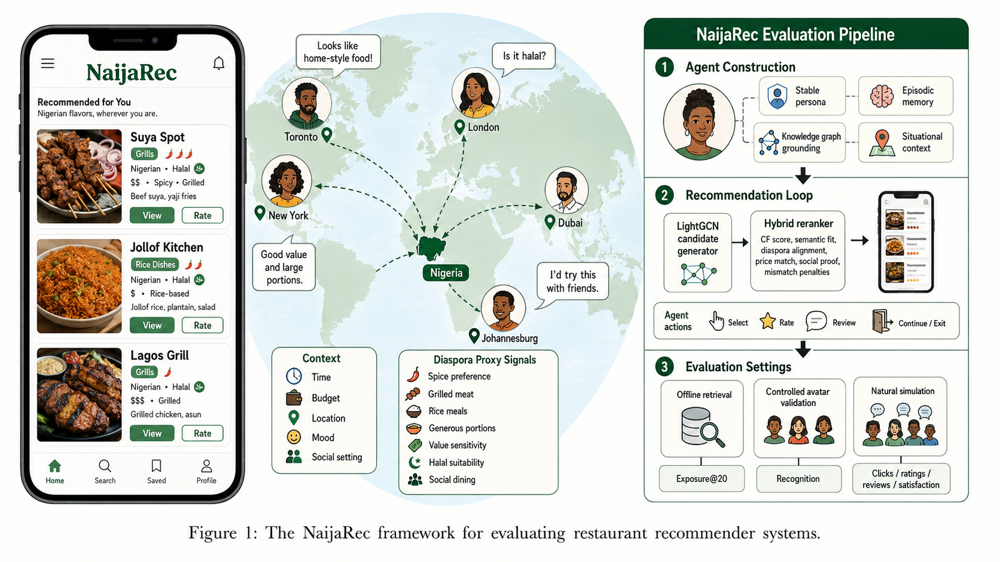

# NIAJAREC: A Context Aware LLM User Simulator for Recommender System Evaluation



<div align="center">
NaijaRec is a context-aware restaurant recommender system simulator with 821 LLM-empowered agents. These agents model Nigerian diaspora dining preferences using stable personas, episodic memory, situational context, and lightweight knowledge-graph grounding.
Each agent interacts with restaurant recommendations generated by a LightGCN candidate model and refined through a hybrid reranker. The agents perform actions such as selecting restaurants, rating them, writing short reviews, and deciding whether to continue or exit a session.
With NaijaRec, we explore how LLM-powered agents can simulate realistic, culturally grounded user behavior in restaurant recommendation environments, especially under changing contexts such as budget, location, mood, time, social setting, and cultural food preferences.
</div>

## Contents

- [Project Structure](#project-structure)
- [Reproduction Tracks](#reproduction-tracks)
- [External Artifacts and Google Drive](#external-artifacts-and-google-drive)
- [Installation](#installation)
- [Provider Configuration](#provider-configuration)
- [Verify the Setup](#verify-the-setup)
- [Run the Full 821-Avatar Evaluation](#run-the-full-821-avatar-evaluation)
- [Run Fast Smoke Tests](#run-fast-smoke-tests)
- [Reproduce Offline Reranking](#reproduce-offline-reranking)
- [Outputs and Metrics](#outputs-and-metrics)
- [Experimental Interpretation](#experimental-interpretation)
- [Troubleshooting](#troubleshooting)
- [Additional Documentation](#additional-documentation)

## Project Structure

The principal files and directories are:

```text
NaijaRec/
|-- main.py                         # Simulation and validation entry point
|-- parse.py                        # Command-line configuration
|-- simulation/                     # Avatar, arena, parsing, and metric logic
|-- recommenders/                   # LightGCN/MF/Random models and evaluation code
|-- scripts/
|   |-- offline_rerank_sweep.py     # Offline hybrid-reranking reproduction
|   `-- generate_chapter4_assets.py # Result tables and figures
|-- datasets/yelp-kimi/             # Required evaluation dataset, supplied externally
|-- recommenders/weights/yelp-kimi/ # Required trained checkpoints, supplied externally
|-- storage/                        # Generated/downloadable experimental outputs
|-- CHAPTER3_METHODOLOGY_README.md
|-- CHAPTER4_RESULTS_README.md
`-- requirements.txt
```

### Required Yelp-Kimi layout

After artifact download, these paths must exist:

```text
datasets/yelp-kimi/
|-- cf_data/
|   |-- train.txt
|   |-- valid.txt
|   |-- test.txt
|   |-- adj_mat.npz
|   `-- s_pre_adj_mat.npz
|-- raw_data/
|   `-- agg_top_25.csv
`-- simulation/
    |-- movie_detail.csv
    |-- all_personas_like_modify.csv
    |-- user_statistic.csv
    |-- avatar_manifest.csv
    `-- knowledge_graph_triples.csv

recommenders/weights/yelp-kimi/LightGCN/
`-- 0515_yelp_lgn_t0p0_Ks=20_patience=10_n_layers=2_batch_size=1024_neg_sample=1_lr=0.0005/
    |-- args.txt
    `-- epoch=84.checkpoint.pth.tar
```

The three interaction split files contain 821 rows each. The persona and
statistics CSV files contain a header plus 821 avatar records.

## Reproduction Tracks

Judges may choose a track according to available time and API access:

| Track                      | Provider                    | Avatars | Purpose                                        | Approximate runtime based on recorded runs |
| -------------------------- | --------------------------- | ------: | ---------------------------------------------- | -----------------------------------------: |
| Full natural simulation    | FreeLLMAPI                  |     821 | Reproduce end-to-end browsing behavior         |                            About 12.6 hours |
| Full controlled validation | FreeLLMAPI                  |     821 | Reproduce preference-recognition validation    |                               About 1.3 hours |
| Natural smoke test         | FreeLLMAPI, Gemini, or Groq |      20 | Confirm installation and LLM output parsing    |                         Provider dependent |
| Validation smoke test      | FreeLLMAPI, Gemini, or Groq |      20 | Confirm validation workflow                    |                         Provider dependent |
| Offline reranking          | No LLM required             |     821 | Reproduce top-20 retrieval/exposure evaluation |                                    Minutes |

The estimates are projections from completed runs on the author's system:

- Natural FreeLLMAPI run: 500 avatars in `14493` seconds, approximately 4.03 hours.
- Controlled FreeLLMAPI validation: 500 avatars in `2211.74` seconds, approximately 36.9 minutes.

API routing load, rate limits, hardware, and network availability will affect
runtime. Metric values involving LLM decisions can also vary slightly between
runs, especially when an API router chooses different underlying models.

## External Artifacts and Google Drive

The project source code can be hosted on GitHub, but data, trained model
weights, source-generation outputs, and full run artifacts are intentionally
excluded through `.gitignore`. A judge reproducing the experiments needs at
least the dataset bundle and the trained LightGCN checkpoint.

**Before public submission, replace every placeholder below with the actual
Google Drive sharing URL and set access to "Anyone with the link can view."**

| Download                                                                          | Required for                                                     |                 Approximate local size | Google Drive link                             |
| --------------------------------------------------------------------------------- | ---------------------------------------------------------------- | -------------------------------------: | --------------------------------------------- |
| `datasets/yelp-kimi/` artifact bundle                                             | Every Yelp-Kimi run                                              |   57 MB total `datasets/` tree locally | `[INSERT_DATASET_GOOGLE_DRIVE_LINK]`          |
| `recommenders/weights/yelp-kimi/` trained checkpoints                             | LightGCN runs                                                    |       22 MB total weights tree locally | `[INSERT_MODEL_WEIGHTS_GOOGLE_DRIVE_LINK]`    |
| `storage/yelp-kimi/LightGCN/HybridRerankDiagnosticAll/rankings/`                  | Offline 821-avatar reproduction without regenerating base scores | About 31 MB for the major 821 matrices | `[INSERT_OFFLINE_RANKINGS_GOOGLE_DRIVE_LINK]` |
| `storage/yelp-kimi/LightGCN/FreeLLMAPINatural500/` and `FreeLLMAPIValidation500/` | Inspect reported completed LLM outputs                           |       Part of 253 MB storage directory | `[INSERT_REPORTED_OUTPUTS_GOOGLE_DRIVE_LINK]` |
| `results/` source/preprocessing products                                          | Regenerate the Yelp-Kimi adapter data                            |                                 125 MB | `[INSERT_SOURCE_RESULTS_GOOGLE_DRIVE_LINK]`   |

### Placing downloaded artifacts

Download and unzip the files so that the directories merge into the cloned
repository root. For example, the final file path for the LightGCN checkpoint
must be:

```text
recommenders/weights/yelp-kimi/LightGCN/0515_yelp_lgn_t0p0_Ks=20_patience=10_n_layers=2_batch_size=1024_neg_sample=1_lr=0.0005/epoch=84.checkpoint.pth.tar
```

Do not place the extracted directories one level too deep, such as
`datasets/yelp-kimi/yelp-kimi/cf_data/`.

## Installation

### Tested software environment

The LLM experiments were executed in a Python 3.9 virtual environment. Python
3.9 is recommended because `reckit`, used by the recommender code, is a legacy
dependency. Newer Google SDK releases may display Python 3.9 end-of-support
warnings; these are warnings and do not alter the NaijaRec commands below.

Recommended prerequisites:

| Component        | Recommendation                                                          |
| ---------------- | ----------------------------------------------------------------------- |
| Operating system | Linux or WSL2                                                           |
| Python           | 3.9                                                                     |
| Memory           | At least 8 GB RAM                                                       |
| GPU              | Optional; CPU is sufficient for evaluation with the supplied checkpoint |
| C/C++ compiler   | Required once for the Cython evaluator extension                        |
| LLM access       | FreeLLMAPI for full runs; FreeLLMAPI, Gemini, or Groq for smoke tests   |

### 1. Clone and enter the repository

```bash
git clone <NAIJAREC_REPOSITORY_URL>
cd <NAIJAREC_REPOSITORY_DIRECTORY>
```

### 2. Create a Python virtual environment

```bash
python3.9 -m venv .venv
source .venv/bin/activate
python -m pip install --upgrade pip setuptools wheel
```

### 3. Install PyTorch

PyTorch is deliberately installed separately because the correct wheel depends
on whether the machine uses CPU or CUDA.

For a CPU-only judging machine:

```bash
pip install torch==2.1.2 --index-url https://download.pytorch.org/whl/cpu
```

For CUDA hardware, install the PyTorch 2.1.2 wheel appropriate for the
installed CUDA driver using the official PyTorch installation selector, then
continue with the same NaijaRec commands.

### 4. Install NaijaRec dependencies

```bash
pip install -r requirements.txt
```

`requirements.txt` is the simulation/research environment. It contains:

| Package group                      | Why it is required                                                            |
| ---------------------------------- | ----------------------------------------------------------------------------- |
| `numpy`, `pandas`, `scipy`         | Dataset loading, sparse matrices, metrics, and rankings                       |
| `matplotlib`, `seaborn`            | Figures and chapter result assets                                             |
| `Cython`, `reckit`                 | Recommender evaluation and compiled helper extension                          |
| `faiss-cpu`                        | Avatar memory vector index                                                    |
| `langchain`, `langchain-community` | Avatar memory and OpenAI-compatible chat wrapper                              |
| `langchain-google-genai`           | Gemini provider support                                                       |
| `python-dotenv`                    | Loads private provider keys from `.env.local`                                 |
| `sentence-transformers`            | Optional Hugging Face embedding mode; standard runs use local hash embeddings |
| `tqdm`, `termcolor`                | Runtime progress and readable logs                                            |
| `wandb`                            | Optional experiment tracking when `--use_wandb` is supplied                   |

The API demonstration app has a separate lightweight environment in
`requirements-api.txt`; it is not needed to reproduce the experiments.

### 5. Build the recommender evaluation extension

Run this once after installing requirements:

```bash
cd recommenders
python setup.py build_ext --inplace
cd ..
```

## Provider Configuration

Create a private `.env.local` file in the repository root. Never commit real
API keys.

### FreeLLMAPI, required for the full 821-avatar commands

FreeLLMAPI is used as an OpenAI-compatible local routing gateway. The gateway
service is not started by NaijaRec; it must already be running and accessible
at its OpenAI-compatible endpoint.

```bash
cat > .env.local <<'EOF'
FREELLMAPI_BASE_URL=http://localhost:3001/v1
FREELLMAPI_API_KEY=replace-with-your-freellmapi-key
EOF
```

Use `--sim_embedding_provider local` with FreeLLMAPI. Local embedding mode is
implemented inside NaijaRec and avoids requiring an embeddings endpoint from
the gateway.

### Gemini, allowed for smoke tests

```bash
cat > .env.local <<'EOF'
GOOGLE_API_KEY=replace-with-your-gemini-api-key
EOF
```

The commands below keep embeddings local; only avatar judgment calls use
Gemini.

### Groq, allowed for smoke tests

```bash
cat > .env.local <<'EOF'
GROQ_API_KEY=replace-with-your-groq-api-key
EOF
```

Groq is appropriate for installation checks and short runs. The reported
large-scale experiment uses FreeLLMAPI, so a Groq smoke result should not be
compared as an identical reproduction of the reported LLM run.

## Verify the Setup

From the repository root with the virtual environment active, check that the
required artifacts are in place:

```bash
test -f datasets/yelp-kimi/cf_data/train.txt
test -f datasets/yelp-kimi/simulation/all_personas_like_modify.csv
test -f datasets/yelp-kimi/simulation/movie_detail.csv
test -f recommenders/weights/yelp-kimi/LightGCN/0515_yelp_lgn_t0p0_Ks=20_patience=10_n_layers=2_batch_size=1024_neg_sample=1_lr=0.0005/epoch=84.checkpoint.pth.tar
wc -l datasets/yelp-kimi/cf_data/train.txt datasets/yelp-kimi/cf_data/valid.txt datasets/yelp-kimi/cf_data/test.txt
```

Expected split row counts:

```text
821 datasets/yelp-kimi/cf_data/train.txt
821 datasets/yelp-kimi/cf_data/valid.txt
821 datasets/yelp-kimi/cf_data/test.txt
```

Confirm that the CLI loads:

```bash
python main.py --help
```

Some LangChain deprecation warnings may appear while modules load; they do not
prevent the documented experiment from running.

## Run the Full 821-Avatar Evaluation

The following commands are the principal reproduction commands. They use the
trained LightGCN recommender, the balanced persona-aware hybrid reranker where
appropriate, the validation ground-truth split, and FreeLLMAPI.

### Full natural simulation: 821 avatars with FreeLLMAPI

This is the complete metric-focused behavioral simulation. Each avatar is
shown five pages with four restaurants per page. Because
`--min_browse_pages 5` equals `--max_pages 5`, every avatar sees the full
top-20 window; this configuration measures fixed-depth exposure and
recognition, not voluntary early exit.

```bash
python -u main.py \
  --simulation_name FreeLLMAPINatural821 \
  --dataset yelp-kimi \
  --modeltype LightGCN \
  --model_path '0515_yelp_lgn_t0p0_Ks=20_patience=10_n_layers=2_batch_size=1024_neg_sample=1_lr=0.0005' \
  --n_avatars 821 \
  --max_pages 5 \
  --min_browse_pages 5 \
  --items_per_page 4 \
  --execution_mode parallel \
  --ground_truth_split valid \
  --sim_llm_provider freellmapi \
  --sim_llm_model auto \
  --sim_llm_base_url http://localhost:3001/v1 \
  --sim_embedding_provider local \
  --sim_llm_max_tokens 450 \
  --sim_llm_min_interval 3 \
  --hybrid_rerank \
  --semantic_candidate_expansion \
  --semantic_candidate_pool_size 200 \
  --semantic_candidate_cf_floor 0.05 \
  --rerank_pool_size 800 \
  --rerank_cf_weight 0.15 \
  --rerank_semantic_weight 0.50 \
  --rerank_diaspora_weight 0.05 \
  --rerank_history_weight 0.0 \
  --rerank_city_weight 0.20 \
  --rerank_price_weight 0.05 \
  --rerank_social_weight 0.03 \
  --rerank_penalty_weight 0.10 \
  --natural_relevance_scope heldout_plus_persona
```

The result summary is written to:

```text
storage/yelp-kimi/LightGCN/FreeLLMAPINatural821/metrics.txt
```

### Optional natural early-exit evaluation: 821 avatars

To evaluate more natural stopping behavior rather than fixed top-20
observation, rerun with a different name and permit exit after the first page:

```bash
python -u main.py \
  --simulation_name FreeLLMAPINaturalExit821 \
  --dataset yelp-kimi \
  --modeltype LightGCN \
  --model_path '0515_yelp_lgn_t0p0_Ks=20_patience=10_n_layers=2_batch_size=1024_neg_sample=1_lr=0.0005' \
  --n_avatars 821 \
  --max_pages 5 \
  --min_browse_pages 1 \
  --items_per_page 4 \
  --execution_mode parallel \
  --ground_truth_split valid \
  --sim_llm_provider freellmapi \
  --sim_llm_model auto \
  --sim_llm_base_url http://localhost:3001/v1 \
  --sim_embedding_provider local \
  --sim_llm_max_tokens 450 \
  --sim_llm_min_interval 3 \
  --hybrid_rerank \
  --semantic_candidate_expansion \
  --semantic_candidate_pool_size 200 \
  --semantic_candidate_cf_floor 0.05 \
  --rerank_pool_size 800 \
  --rerank_cf_weight 0.15 \
  --rerank_semantic_weight 0.50 \
  --rerank_diaspora_weight 0.05 \
  --rerank_history_weight 0.0 \
  --rerank_city_weight 0.20 \
  --rerank_price_weight 0.05 \
  --rerank_social_weight 0.03 \
  --rerank_penalty_weight 0.10 \
  --natural_relevance_scope heldout_plus_persona
```

This optional run answers a different research question and must be reported
separately from the fixed-depth run.

### Full controlled validation: 821 avatars with FreeLLMAPI

Controlled validation evaluates whether each persona recognizes held-out
preference-consistent restaurants among unobserved alternatives. It is not a
page-ranking evaluation, so the natural simulation reranking and page flags
are intentionally absent.

With `--validation_rounds 1`, there is one LLM judgment call per avatar. This
matches the protocol used for the recorded 500-avatar controlled-validation
result and keeps a full 821-avatar validation practical.

```bash
python -u main.py \
  --simulation_name FreeLLMAPIValidation821 \
  --dataset yelp-kimi \
  --modeltype LightGCN \
  --model_path '0515_yelp_lgn_t0p0_Ks=20_patience=10_n_layers=2_batch_size=1024_neg_sample=1_lr=0.0005' \
  --n_avatars 821 \
  --val_users \
  --val_ratio 1 \
  --validation_prompt_mode calibrated \
  --validation_rounds 1 \
  --execution_mode parallel \
  --sim_llm_provider freellmapi \
  --sim_llm_model auto \
  --sim_llm_base_url http://localhost:3001/v1 \
  --sim_embedding_provider local \
  --sim_llm_max_tokens 450 \
  --sim_llm_min_interval 3
```

The result summary is written to:

```text
storage/yelp-kimi/LightGCN/FreeLLMAPIValidation821/validation_metrics.txt
```

### Optional majority-vote validation

For a stronger but slower robustness check, use three independent LLM
judgments per avatar and majority voting:

```bash
python -u main.py \
  --simulation_name FreeLLMAPIValidation821Rounds3 \
  --dataset yelp-kimi \
  --modeltype LightGCN \
  --model_path '0515_yelp_lgn_t0p0_Ks=20_patience=10_n_layers=2_batch_size=1024_neg_sample=1_lr=0.0005' \
  --n_avatars 821 \
  --val_users \
  --val_ratio 1 \
  --validation_prompt_mode calibrated \
  --validation_rounds 3 \
  --execution_mode parallel \
  --sim_llm_provider freellmapi \
  --sim_llm_model auto \
  --sim_llm_base_url http://localhost:3001/v1 \
  --sim_embedding_provider local \
  --sim_llm_max_tokens 450 \
  --sim_llm_min_interval 3
```

This uses three times as many LLM calls as the primary validation protocol and
must be labelled as a separate majority-vote experiment.

## Run Fast Smoke Tests

Smoke tests confirm installation, checkpoint loading, provider access, and
response parsing. They do not replace the 821-avatar evaluation. Every smoke
command below uses 20 avatars.

### FreeLLMAPI natural smoke test

```bash
python -u main.py \
  --simulation_name SmokeFreeLLMAPINatural20 \
  --dataset yelp-kimi \
  --modeltype LightGCN \
  --model_path '0515_yelp_lgn_t0p0_Ks=20_patience=10_n_layers=2_batch_size=1024_neg_sample=1_lr=0.0005' \
  --n_avatars 20 \
  --max_pages 5 \
  --min_browse_pages 5 \
  --items_per_page 4 \
  --execution_mode parallel \
  --ground_truth_split valid \
  --sim_llm_provider freellmapi \
  --sim_llm_model auto \
  --sim_llm_base_url http://localhost:3001/v1 \
  --sim_embedding_provider local \
  --sim_llm_max_tokens 450 \
  --sim_llm_min_interval 3 \
  --hybrid_rerank \
  --semantic_candidate_expansion \
  --semantic_candidate_pool_size 200 \
  --semantic_candidate_cf_floor 0.05 \
  --rerank_pool_size 800 \
  --rerank_cf_weight 0.15 \
  --rerank_semantic_weight 0.50 \
  --rerank_diaspora_weight 0.05 \
  --rerank_history_weight 0.0 \
  --rerank_city_weight 0.20 \
  --rerank_price_weight 0.05 \
  --rerank_social_weight 0.03 \
  --rerank_penalty_weight 0.10 \
  --natural_relevance_scope heldout_plus_persona
```

### FreeLLMAPI validation smoke test

```bash
python -u main.py \
  --simulation_name SmokeFreeLLMAPIValidation20 \
  --dataset yelp-kimi \
  --modeltype LightGCN \
  --model_path '0515_yelp_lgn_t0p0_Ks=20_patience=10_n_layers=2_batch_size=1024_neg_sample=1_lr=0.0005' \
  --n_avatars 20 \
  --val_users \
  --val_ratio 1 \
  --validation_prompt_mode calibrated \
  --validation_rounds 1 \
  --execution_mode parallel \
  --sim_llm_provider freellmapi \
  --sim_llm_model auto \
  --sim_llm_base_url http://localhost:3001/v1 \
  --sim_embedding_provider local \
  --sim_llm_max_tokens 450 \
  --sim_llm_min_interval 3
```

### Gemini natural smoke test

This option requires `GOOGLE_API_KEY` in `.env.local`. The longer minimum
interval is deliberately conservative for hosted API quotas.

```bash
python -u main.py \
  --simulation_name SmokeGeminiNatural20 \
  --dataset yelp-kimi \
  --modeltype LightGCN \
  --model_path '0515_yelp_lgn_t0p0_Ks=20_patience=10_n_layers=2_batch_size=1024_neg_sample=1_lr=0.0005' \
  --n_avatars 20 \
  --max_pages 5 \
  --min_browse_pages 5 \
  --items_per_page 4 \
  --execution_mode parallel \
  --ground_truth_split valid \
  --sim_llm_provider gemini \
  --sim_embedding_provider local \
  --sim_llm_max_tokens 450 \
  --sim_llm_min_interval 25 \
  --hybrid_rerank \
  --semantic_candidate_expansion \
  --semantic_candidate_pool_size 200 \
  --semantic_candidate_cf_floor 0.05 \
  --rerank_pool_size 800 \
  --rerank_cf_weight 0.15 \
  --rerank_semantic_weight 0.50 \
  --rerank_diaspora_weight 0.05 \
  --rerank_history_weight 0.0 \
  --rerank_city_weight 0.20 \
  --rerank_price_weight 0.05 \
  --rerank_social_weight 0.03 \
  --rerank_penalty_weight 0.10 \
  --natural_relevance_scope heldout_plus_persona
```

### Gemini validation smoke test

```bash
python -u main.py \
  --simulation_name SmokeGeminiValidation20 \
  --dataset yelp-kimi \
  --modeltype LightGCN \
  --model_path '0515_yelp_lgn_t0p0_Ks=20_patience=10_n_layers=2_batch_size=1024_neg_sample=1_lr=0.0005' \
  --n_avatars 20 \
  --val_users \
  --val_ratio 1 \
  --validation_prompt_mode calibrated \
  --validation_rounds 1 \
  --execution_mode parallel \
  --sim_llm_provider gemini \
  --sim_embedding_provider local \
  --sim_llm_max_tokens 450 \
  --sim_llm_min_interval 25
```

### Groq natural smoke test

This option requires `GROQ_API_KEY` in `.env.local`.

```bash
python -u main.py \
  --simulation_name SmokeGroqNatural20 \
  --dataset yelp-kimi \
  --modeltype LightGCN \
  --model_path '0515_yelp_lgn_t0p0_Ks=20_patience=10_n_layers=2_batch_size=1024_neg_sample=1_lr=0.0005' \
  --n_avatars 20 \
  --max_pages 5 \
  --min_browse_pages 5 \
  --items_per_page 4 \
  --execution_mode parallel \
  --ground_truth_split valid \
  --sim_llm_provider groq \
  --sim_llm_model llama-3.1-8b-instant \
  --sim_embedding_provider local \
  --sim_llm_max_tokens 450 \
  --sim_llm_min_interval 16 \
  --hybrid_rerank \
  --semantic_candidate_expansion \
  --semantic_candidate_pool_size 200 \
  --semantic_candidate_cf_floor 0.05 \
  --rerank_pool_size 800 \
  --rerank_cf_weight 0.15 \
  --rerank_semantic_weight 0.50 \
  --rerank_diaspora_weight 0.05 \
  --rerank_history_weight 0.0 \
  --rerank_city_weight 0.20 \
  --rerank_price_weight 0.05 \
  --rerank_social_weight 0.03 \
  --rerank_penalty_weight 0.10 \
  --natural_relevance_scope heldout_plus_persona
```

### Groq validation smoke test

```bash
python -u main.py \
  --simulation_name SmokeGroqValidation20 \
  --dataset yelp-kimi \
  --modeltype LightGCN \
  --model_path '0515_yelp_lgn_t0p0_Ks=20_patience=10_n_layers=2_batch_size=1024_neg_sample=1_lr=0.0005' \
  --n_avatars 20 \
  --val_users \
  --val_ratio 1 \
  --validation_prompt_mode calibrated \
  --validation_rounds 1 \
  --execution_mode parallel \
  --sim_llm_provider groq \
  --sim_llm_model llama-3.1-8b-instant \
  --sim_embedding_provider local \
  --sim_llm_max_tokens 450 \
  --sim_llm_min_interval 16
```

## Reproduce Offline Reranking

This part requires no LLM key. It evaluates recommendation exposure and ranking
metrics before avatar behavioral judgments. If the supplied Drive artifact
already includes `full_rankings_821.npy`, run:

```bash
python -u scripts/offline_rerank_sweep.py \
  --dataset yelp-kimi \
  --modeltype LightGCN \
  --simulation_name HybridRerankDiagnosticAll \
  --rankings_file storage/yelp-kimi/LightGCN/HybridRerankDiagnosticAll/rankings/full_rankings_821.npy \
  --n_avatars 821 \
  --ground_truth_split valid \
  --top_k 20 \
  --pool_sizes 800 \
  --cf_weights 0.15 \
  --semantic_weights 0.50 \
  --diaspora_weights 0.05 \
  --history_weights 0.0 \
  --city_weights 0.20 \
  --price_weights 0.05 \
  --social_weights 0.03 \
  --penalty_weights 0.10 \
  --semantic_candidate_expansion \
  --semantic_candidate_pool_sizes 200 \
  --semantic_candidate_cf_floor 0.05 \
  --selection_objective balanced \
  --output storage/yelp-kimi/LightGCN/HybridRerankDiagnosticAll/rankings/reproduced_balanced_rerank_821.csv \
  --save_best_ranking
```

The study reports offline retrieval on all 821 avatars; see
`CHAPTER4_RESULTS_README.md` for the reported tables and figures.

## Outputs and Metrics

Each run writes into:

```text
storage/yelp-kimi/LightGCN/<simulation_name>/
```

### Natural simulation outputs

| Output                                  | Meaning                                                                                  |
| --------------------------------------- | ---------------------------------------------------------------------------------------- |
| `metrics.txt`                           | Aggregate click, rating, satisfaction, parsing, exposure, precision, and recall measures |
| `running_logs/<avatar_id>.txt`          | Individual avatar runtime logs                                                           |
| `behavior/<avatar_id>.pkl`              | Parsed per-page behavior                                                                 |
| `interview/<avatar_id>.pkl`             | Final satisfaction interview                                                             |
| `rankings/full_rankings_<n>.npy`        | Base ranking matrix                                                                      |
| `rankings/full_rankings_<n>_hybrid.npy` | Persona-aware reranked matrix when enabled                                               |

Important natural-simulation metrics:

| Metric                       | Interpretation                                                            |
| ---------------------------- | ------------------------------------------------------------------------- |
| `Overall click rate`         | Proportion of displayed restaurants selected                              |
| `True satisfaction score`    | Normalized post-session interview satisfaction                            |
| `Parse-valid rate`           | Fraction of page responses parsed successfully                            |
| `Ground-truth items exposed` | Number of held-out valid items displayed in recommendation pages          |
| `Grounded recognition rate`  | Fraction of exposed held-out items selected by avatars                    |
| `Expanded micro recall`      | Recognition under the expanded held-out plus persona-relevance definition |

### Controlled-validation outputs

| Output                   | Meaning                                                    |
| ------------------------ | ---------------------------------------------------------- |
| `validation_metrics.txt` | Average precision, recall, accuracy, and F1 across avatars |
| terminal response logs   | Per-avatar `WATCH: yes/no` decisions and metric traces     |

Controlled validation uses one response per avatar when
`--validation_rounds 1` is selected. Page browsing settings and hybrid ranking
weights are not needed for this protocol.

### Recreate Chapter 4 result assets

After obtaining the expected stored metric files, figures and CSV summaries can
be generated with:

```bash
python scripts/generate_chapter4_assets.py
```

Generated assets are written to `chapter4_assets/`.

## Experimental Interpretation

The reproduction workflows must not be conflated:

| Workflow              | What it establishes                                                             | What it does not establish        |
| --------------------- | ------------------------------------------------------------------------------- | --------------------------------- |
| Offline reranking     | Whether relevant held-out restaurants appear in top-20 rankings                 | LLM user behavior or satisfaction |
| Controlled validation | Whether persona avatars identify held-out preference matches among alternatives | Organic recommendation exposure   |
| Natural simulation    | Whether shown recommendations lead to simulated selection and satisfaction      | Causal human user response        |

Additional reporting rules:

- The standard evaluation uses `--ground_truth_split valid`.
- `--inject_ground_truth` is not used in the reported natural simulation;
  enabling it creates a controlled exposure probe and changes interpretation.
- `--allow_train_recommendations` is an ablation flag and should remain off for
  standard held-out evaluation.
- `--min_browse_pages 5 --max_pages 5` forces complete top-20 observation, so
  it must not be described as natural early-exit behavior.
- FreeLLMAPI may route calls across models; record the router configuration and
  describe results as FreeLLMAPI/OpenAI-compatible routed runs unless a single
  underlying model is fixed externally.

## Troubleshooting

### Missing dataset or checkpoint

Typical symptoms are `FileNotFoundError` for `movie_detail.csv`, persona CSVs,
or checkpoint files. Re-extract the Google Drive artifact bundle into the
repository root and rerun the verification commands.

### FreeLLMAPI connection failure

Confirm that the gateway is running at the URL supplied in
`FREELLMAPI_BASE_URL` and that `.env.local` includes a valid
`FREELLMAPI_API_KEY`. NaijaRec does not launch that external service.

### Hosted-provider rate limits

Increase `--sim_llm_min_interval` when Gemini or Groq reports quota or
rate-limit errors. Lower values make runs faster but do not change the
recommender configuration.

### Output responses fail to parse

Inspect `metrics.txt` for `Parse-valid rate` and the individual files under
`running_logs/`. A smoke test should be completed before an expensive full
run, especially with a new provider or routing configuration.

### Cython build issue

Ensure a C/C++ build toolchain and `Cython` are installed, then rerun:

```bash
cd recommenders
python setup.py build_ext --inplace
cd ..
```

## Additional Documentation

- `CHAPTER3_METHODOLOGY_README.md`: methodology, architecture, dataset, and
  research design.
- `CHAPTER4_RESULTS_README.md`: recorded results, tables, plots, and
  interpretation.
- `RESEARCH_README.md`: extended experimental notes.
- `WEBAPP_README.md`: optional demonstration API and deployment instructions.

## License

See `LICENSE`.
